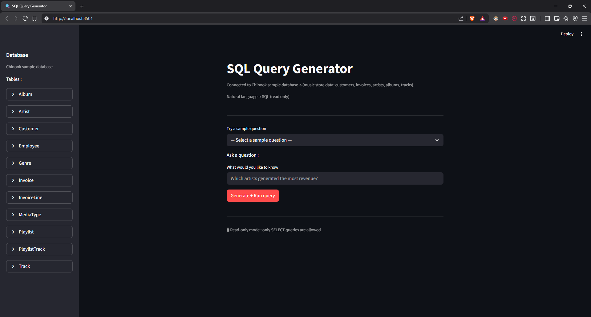

# SQL Query Generator 🔍

A safe, schema-aware **Natural Language → SQL** application that allows users to query a database using plain English.
The system generates SQL using an LLM, validates it for safety, and executes it in a controlled, read-only manner.

[Live Demo](https://querymate-ai.streamlit.app/)

---

## 🎯 What It Does

This application allows users to ask questions about a database in natural language and receive query results without writing SQL manually.

**Example flow:**

User question → LLM generates SQL → Validator checks safety → Executor runs query → Results displayed

## ✨ Features

- 🤖 Natural Language to SQL
- 🧠 Schema-Aware Prompting (LLM sees actual DB schema)
- 🛡️ Read-Only SQL Enforcement (SELECT-only execution)
- 📊 Database Schema Viewer
- 💡 Sample Questions for Quick Start
- 🎨 Simple, Clean UI built with Streamlit

## 🧩 Architecture Overview

The application is structured into clear, single-responsibility modules:

- **UI (app.py)** – User interaction and result display
- **Service Layer (service.py**) – Orchestrates the NL → SQL pipeline
- **LLM (llm.py)** – Converts natural language to SQL
- **Validator (validator.py)** – Enforces SQL safety rules
- **Executor (executor.py)** – Executes validated queries
- **Schema (schema.py)** – Extracts database metadata
- **Config (config.py)** – Centralized configuration

This separation keeps the system debuggable, safe, and maintainable.

## 🔒 Safety Design

Multiple layers prevent unsafe execution:

- Only SELECT queries are allowed
- Dangerous keywords (DROP, ALTER, PRAGMA, etc.) are blocked
- Multiple SQL statements are disallowed
- Executor performs a final safety check before execution
- Errors are handled gracefully and surfaced to the user

## ⚠️ Known Limitations

- Fixed sample database (SQLite Chinook DB)
- Read-only queries only
- Complex or ambiguous questions may fail
- SQLite-specific schema introspection
- Not optimized for large datasets

## 🛠️ Tech Stack

- **Python**
- **Streamlit**
- **SQLite**
- **Groq API**
- **Pandas**
- **LLaMA 3.3 70B**

## 📸 Screenshots

---

**Built as a practical, production-minded AI engineering project** 🚀