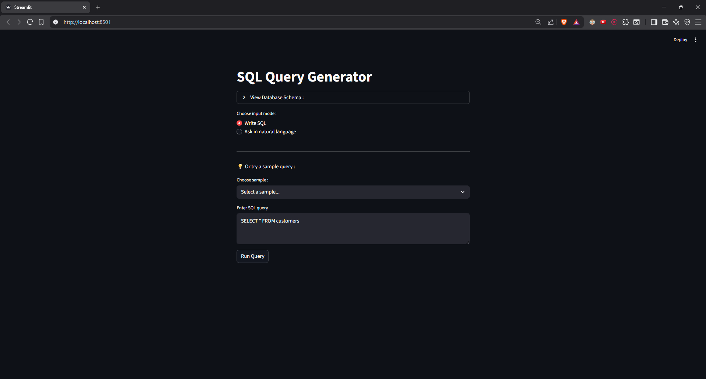

# SQL Query Generator 🔍

Natural language to SQL query system - Ask questions about your database in plain English, get SQL queries generated, validated, and executed automatically.

[Live Demo](YOUR_STREAMLIT_URL_HERE) | [GitHub](YOUR_GITHUB_REPO_URL)

## 🎯 What It Does

This application allows non-technical users to query databases using natural language. It generates SQL queries using LLM technology, validates them for safety, and displays results in an easy-to-read format.

**Example:**
```
User: "Show me customers who spent more than 1000"
System: Generates → SELECT * FROM customers WHERE total_spent > 1000
System: Validates → Safe ✅
System: Executes → Shows results
```

## ✨ Features

- 🤖 **Natural Language to SQL** - Ask questions in plain English
- 🛡️ **Query Validation** - Prevents dangerous operations (DROP, DELETE without WHERE, etc.)
- 📊 **Database Schema Viewer** - See available tables and columns
- 💡 **Sample Queries** - Pre-built examples to get started
- ⚡ **Dual Input Modes** - Write SQL directly or use natural language
- 🎨 **Clean UI** - Built with Streamlit for easy interaction

## 🛠️ Tech Stack

- **Python** - Core programming language
- **Streamlit** - Web UI framework
- **SQLite** - Database (easily adaptable to MySQL/PostgreSQL)
- **Groq API** - LLM for natural language processing
- **LLaMA 3.3 70B** - Language model for SQL generation


## 📸 Screenshots

[TODO: Add screenshots here after deployment]

### Natural Language Mode


### SQL Mode with Validation


## 🔒 Safety Features

The application includes multiple safety layers:

- **Query Validation**: Blocks DROP, TRUNCATE, ALTER commands
- **WHERE Clause Enforcement**: Prevents DELETE/UPDATE without conditions
- **Error Handling**: Graceful failure with user-friendly messages
- **Preview Before Execute**: Shows generated SQL before running

---

**Built as part of my AI/ML learning journey** 🚀